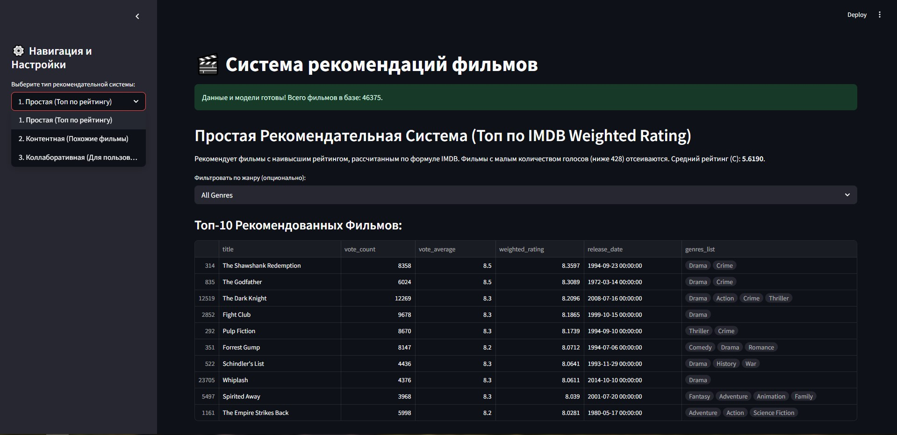

# Рекомендательная система фильмов

Веб-приложение на Streamlit для получения рекомендаций фильмов на основе контента и коллаборативной фильтрации.

## Функциональность

- Топ n фильмов по жанрам на основе взвешанного рейтинга
- Рекомендации на основе контента (на основе описания / метаданных)
- Коллаборативная фильтрация (рекомендации на основе оценок пользователей)


## Установка

1. Установите зависимости:

```bash
pip install -r requirements.txt
```

2. Запустите приложение:

```bash
streamlit run app.py
```

## Использование

1. Выберите тип рекомендаций в боковой панели
2. Для получения топ фильмов по жанру:
   - Выберите жанр
   - Нажмите "Получить рекомендации"
3. Для рекомендаций на основе контента:
   - Выберите фильм из списка
   - Нажмите "Получить рекомендации"
4. Для коллаборативных рекомендаций:
   - Введите ID пользователя
   - Нажмите "Получить рекомендации"

## Данные

Приложение использует следующие наборы данных:

- movies_metadata.csv - метаданные фильмов
- credits.csv - информация об актерах и съемочной группе
- keywords.csv - ключевые слова фильмов
- ratings_small.csv - оценки пользователей
- links.csv - связи между различными ID фильмов


